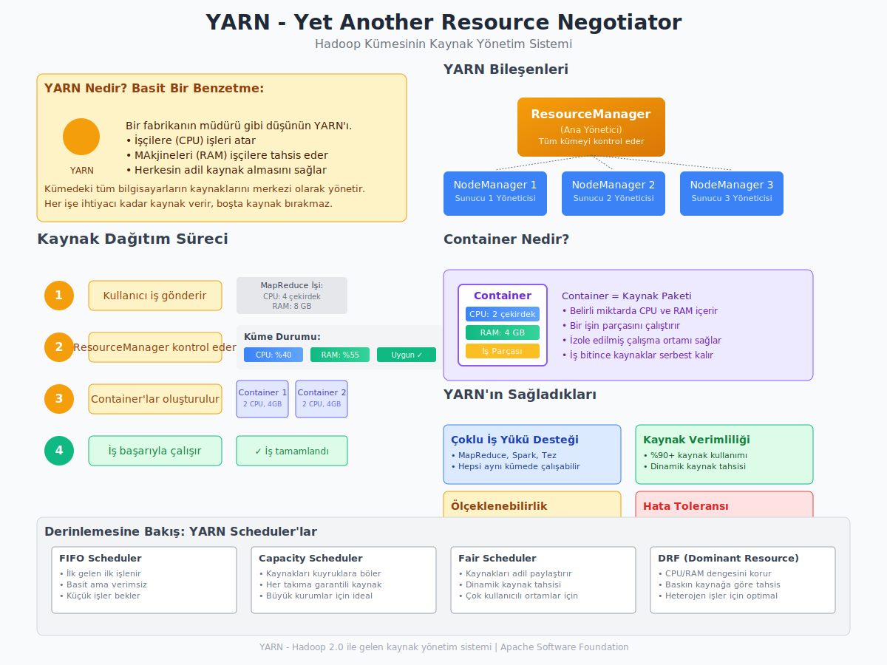

***

Merhaba gençler,

Bugün sizlerle son yılların en popüler konularından biri olan **Büyük Veri (Big Data)** üzerine konuşacağız. Bu kavramı muhtemelen duymuşsunuzdur ama tam olarak ne anlama geldiğini, neden bu kadar önemli olduğunu ve arkasındaki teknolojileri adım adım inceleyeceğiz.

### Büyük Veri Nedir?

En basit haliyle başlayalım. Elinizde tek bir kitaptan oluşan bir bilgi olduğunu düşünün. İçindeki bilgileri bulmak, analiz etmek oldukça kolaydır. Şimdi, o tek kitap yerine dünyanın en büyük kütüphanesindeki tüm kitapların, dergilerin, ses kayıtlarının ve videoların bir anda önünüze yığıldığını hayal edin. Üstelik bu kütüphaneye her saniye binlerce yeni materyal ekleniyor. İşte bu devasa, karmaşık ve sürekli büyüyen bilgi yığınına **Büyük Veri** diyoruz.

Geleneksel yöntemlerimiz, yani standart bir bilgisayar ve basit programlar, bu kütüphaneyi anlamlandırmak için yetersiz kalır. Bir soru sorduğunuzda cevabı saatler, hatta günler sürebilir. Büyük Veri alanı, tam da bu sorunu çözmek için var. Yani, birbirinden farklı kaynaklardan gelen (sosyal medya, sensörler, web siteleri, banka işlemleri vb.) devasa veri koleksiyonlarını;

*   Analiz etmeye,
*   İşlemeye,
*   ve Depolamaya adanmış bir alandır.

Büyük Veri'nin temel amacı, bu veri yığınının içindeki **değeri**, yani **anlamı** ortaya çıkarmaktır. Tıpkı bir madencinin tonlarca toprağı eleyerek değerli madenleri bulması gibi, biz de Büyük Veri'yi işleyerek değerli bilgilere ve öngörülere ulaşırız.

### Büyük Veri'nin Getirdiği Kazanımlar

Peki, bu devasa veriyi işlediğimizde elimize ne geçiyor? Elde ettiğimiz sonuçlar, kurumlar için çok çeşitli öngörülere ve kazanımlara yol açabilir. Örneğin:

*   **Operasyonel Optimizasyon:** Bir fabrikanın üretim hattındaki sensör verilerini analiz ederek arızaları önceden tespit edebilir ve üretimi daha verimli hale getirebiliriz.
*   **Eyleme Geçirilebilir Bilgi:** Müşteri davranışlarını analiz ederek onlara en uygun ürünleri, doğru zamanda sunabiliriz.
*   **Yeni Pazarların Tanımlanması:** Toplumdaki yeni eğilimleri ve ihtiyaçları herkesten önce fark ederek yeni iş fırsatları yaratabiliriz.
*   **Doğru Tahminler:** Hava durumu tahminlerinden borsa hareketlerine kadar, geçmiş verileri analiz ederek geleceğe dair daha isabetli öngörülerde bulunabiliriz.
*   **Hata ve Sahtekarlık Tespiti:** Bankacılıkta, anormal işlem desenlerini anında tespit ederek sahtekarlığı önleyebiliriz.
*   **Geliştirilmiş Karar Verme:** Sezgilere veya sınırlı bilgilere dayanmak yerine, somut verilere dayalı daha sağlam ve doğru kararlar alabiliriz.
*   **Bilimsel Keşifler:** Genom verilerinin analizinden uzay araştırmalarına kadar, bilim dünyasında çığır açan keşiflere imkan tanır.

### Veri Analitiği: Veriyi Anlamlandırma Sanatı

Büyük Veri'yi topladık, peki onu nasıl anlamlı hale getireceğiz? İşte burada **Veri Analitiği (Data Analytics)** devreye giriyor. Veri analitiği, ham veriden anlamlı sonuçlar çıkarmak için kullandığımız yöntemlerin, tekniklerin ve araçların tümünü kapsayan geniş bir disiplindir.

Bu analiz sürecini dört ana kategoriye ayırabiliriz. Bunu bir doktorun hasta teşhisi gibi düşünebilirsiniz:

1.  **Açıklayıcı Analitik (Descriptive Analytics): "Ne Oldu?"**
    Bu en temel analiz türüdür. Geçmişte ne olduğunu özetler.
    *   *Doktorun teşhisi:* "Hastanın ateşi 39 derece."
    *   *İş dünyasından örnekler:* "Geçen ay ne kadar satış yaptık?", "Hangi bölgeden daha çok destek talebi geldi?"

2.  **Tanısal Analitik (Diagnostic Analytics): "Neden Oldu?"**
    Olayların arkasındaki nedenleri bulmaya odaklanır.
    *   *Doktorun teşhisi:* "Kan tahlili sonuçlarına göre bu yüksek ateşin sebebi bakteriyel bir enfeksiyon."
    *   *İş dünyasından örnekler:* "Neden ikinci çeyrek satışları ilk çeyrekten daha düşüktü?", "Doğu bölgesindeki destek çağrıları neden Batı'dan fazlaydı?"

3.  **Tahmine Dayalı Analitik (Predictive Analytics): "Ne Olacak?"**
    Geçmiş verilerdeki desenleri kullanarak gelecekte ne olabileceğini tahmin eder.
    *   *Doktorun teşhisi:* "Bu enfeksiyon türü genellikle 3 gün içinde ilaç tedavisiyle kontrol altına alınır."
    *   *İş dünyasından örnekler:* "Bir müşterinin kredi borcunu ödememe olasılığı nedir?", "Bu reklam kampanyası yürütülürse satışlar ne kadar artar?"

4.  **Yönetsel (Normatif) Analitik (Prescriptive Analytics): "Ne Yapmalıyız?"**
    En gelişmiş analiz türüdür. Sadece ne olacağını söylemekle kalmaz, en iyi sonuca ulaşmak için ne yapılması gerektiğini de önerir.
    *   *Doktorun teşhisi:* "En iyi sonuç için bu antibiyotiği günde iki kez almalısınız."
    *   *İş dünyasından örnekler:* "Talebi karşılamak için hangi depodan hangi mağazaya ne kadar ürün göndermeliyiz?", "Kârı maksimize etmek için hangi ürünlere indirim yapmalıyız?"

### Büyük Veri'nin 5 Temel Özelliği (5V)

Bir veri setinin "Büyük Veri" olarak adlandırılabilmesi için genellikle "V" harfiyle başlayan beş temel özelliğe sahip olması beklenir.

1.  **Hacim (Volume):** Veri miktarının çok büyük olmasıdır. Gigabaytlar, terabaytlar, hatta petabaytlar seviyesinde veri söz konusudur. Örneğin, Facebook her gün yüz milyonlarca fotoğraf ve video yüklüyor.

2.  **Hız (Velocity):** Verinin ne kadar hızlı üretildiğini ve işlenmesi gerektiğini belirtir. Bir yangın musluğundan akan su gibi düşünebilirsiniz. Örneğin, borsadaki anlık işlemler, bir jet motorundan gelen sensör verileri veya saniyede atılan binlerce tweet.

3.  **Çeşitlilik (Variety)::** Verinin farklı türlerde ve formatlarda olmasını ifade eder. Sadece sayılardan oluşan düzenli tablolar (yapılandırılmış veri) değil, aynı zamanda metinler, e-postalar, videolar, ses kayıtları, fotoğraflar (yapılandırılmamış veri) ve XML/JSON dosyaları (yarı yapılandırılmış veri) gibi çok çeşitli formatları içerir.

4.  **Doğruluk (Veracity):** Verinin kalitesini ve güvenilirliğini temsil eder. İnternetteki her bilgi doğru değildir, değil mi? Veri setleri de "gürültü" içerebilir; yani eksik, hatalı veya tutarsız bilgiler barındırabilir. Analizden önce bu veriyi temizlemek ve doğruluğundan emin olmak çok önemlidir.

5.  **Değer (Value):** En önemli özellik budur. Eğer işlediğimiz veri, bize bir fayda sağlamıyor, bir sorunu çözmüyor veya bir karar almamıza yardımcı olmuyorsa, o veriyi toplamanın ve işlemenin bir anlamı yoktur. Verinin değeri, ne kadar doğru olduğu ve ne kadar hızlı işlenip anlamlı bir sonuca dönüştürüldüğü ile doğrudan ilişkilidir.

## Büyük Veri Depolama ve İşleme: Hadoop'a Giriş

Peki, bu devasa ve karmaşık veriyi nerede ve nasıl işleyeceğiz? Tek bir süper bilgisayar bile bu yükün altından kalkamaz. Çözüm, gücü bölmek ve dağıtmaktır. İşte burada **kümeler (clusters)** ve **dağıtılmış sistemler** devreye giriyor.

*   **Küme (Cluster):** Birbirine hızlı bir ağ ile bağlı çok sayıda standart bilgisayarın (bunlara *düğüm* veya *node* denir) tek bir sistem gibi çalışmasıdır. Görev, küçük parçalara bölünür ve her bir bilgisayar görevin bir parçasını üstlenir.
*   **Dağıtılmış Dosya Sistemi:** Büyük bir dosyayı tek bir bilgisayarda saklamak yerine, onu küçük parçalara (*bloklara*) bölerek kümedeki farklı bilgisayarlara dağıtan bir sistemdir. Böylece hem depolama kapasitesi artar hem de veriye aynı anda birden çok bilgisayar erişebilir.

Peki Hadoop tam olarak nedir? Şöyle düşünelim: Çok büyük bir yapbozu tek başınıza tamamlamanız haftalar sürebilir. Ama aynı yapbozu 100 arkadaşınıza dağıtırsanız, her biri kendi küçük parçasını yapar ve sonra bu parçaları birleştirerek yapbozu çok daha hızlı tamamlarsınız. Hadoop, tam olarak bu mantıkla çalışır; devasa bir veri işleme görevini, standart donanımlara sahip yüzlerce, hatta binlerce bilgisayardan oluşan bir kümeye dağıtır ve paralel olarak çözmelerini sağlar.

Daha yapısal bir bakışla, Hadoop'u dört ana bileşenden oluşan bir çerçeve olarak tanımlayabiliriz, bunlar:


1.  **HDFS (Hadoop Distributed File System):** Hadoop'un dağıtılmış depolama birimidir. Büyük dosyaları *blok* adı verilen parçalara ayırır ve kümedeki farklı makinelere dağıtır. Veri kaybını önlemek için her bloğun kopyalarını oluşturur ve farklı makinelere yedekler. Bu işleme *replikasyon* denir ve sistemin hataya karşı dayanıklı olmasını sağlar.

    

2.  **YARN (Yet Another Resource Negotiator):** Kümenin kaynak yöneticisidir. Hangi işin hangi makinede çalışacağını planlar, işlem gücü (CPU) ve bellek (RAM) gibi kaynakları işler arasında adil bir şekilde dağıtır. Kısacası kümenin işletim sistemi gibi davranır.

    ### YARN'ı Anlamak: Küme Kaynak Yönetimine Bir Bakış

    Gençler, YARN'ı anlamanın en anlaşılır yolu, onu büyük bir veri işleme fabrikasının operasyon müdürü olarak hayal etmektir. Bu fabrikada, işleri yapan işçiler (CPU çekirdekleri) ve bu işler için kullanılan makineler (RAM) bulunur. Müşterilerden, yani biz kullanıcılardan, sürekli olarak çeşitli siparişler (veri işleme görevleri) gelir.

    İşte YARN, bu fabrikanın yöneticisi olarak sahneye çıkar. Görevi, gelen her siparişi incelemek, fabrikanın hangi bölümünde ne kadar işçi ve makinenin boş olduğunu bilmek ve bu siparişleri en verimli şekilde uygun işçilere ve makinelere dağıtmaktır.

    Bu yönetici, işleri **"Container"** adını verdiğimiz standart çalışma kutularına yerleştirir. Her bir kutunun içinde, işin belirli bir parçasını tamamlamak için gereken miktarda işçi gücü (CPU) ve makine kapasitesi (RAM) bulunur. Bir işin parçası bu kutuda çalışır, görevini tamamladığında kutu boşalır ve derhal yeni bir iş için kullanılabilir hale gelir. Bu sayede fabrika atıl kalmaz ve sürekli üretim halinde olur.

    Bu sistemden önce, fabrika sadece tek tip bir sipariş alabiliyordu (örneğin yalnızca MapReduce işleri). YARN sayesinde artık fabrikamız aynı anda hem büyük montaj işleri (MapReduce), hem hızlı prototipleme (Spark) hem de özel üretim (Tez) gibi farklı nitelikteki işleri yürütebiliyor. Bu da kaynakların çok daha esnek ve verimli kullanılmasını sağlıyor.

    ## Mimarisi ve Çalışma Prensipleri

    Şimdi bu yapının teknik bileşenlerine ve işleyişine daha yakından bakalım. YARN, dağıtık bir sistemde kaynakları yönetmek ve işleri planlamak için tasarlanmış bir mimaridir. İki temel bileşenden oluşur:

    ### Ana Bileşenler

    *   **ResourceManager (RM):** Tüm kümenin (fabrikanın) genel müdürüdür. Kümedeki tüm kaynakların (işçiler ve makineler) envanterini tutar ve hangi uygulamanın ne kadar kaynak alacağına nihai olarak karar verir. Tek ve merkezi bir otoritedir. Kendi içinde iki önemli servisi barındırır:
        *   **Scheduler:** Hangi işin ne zaman ve hangi kaynaklarla çalışacağını belirleyen planlama algoritmasını çalıştırır. Gelen kaynak taleplerini mevcut politikalara göre (FIFO, Capacity, Fair) değerlendirir ve onaylar.
        *   **ApplicationManager:** Kullanıcı tarafından gönderilen işleri kabul eder ve her iş için özel bir yönetici olan `ApplicationMaster`'ı başlatmak üzere ilk Container'ı ayarlar.

    *   **NodeManager (NM):** Kümedeki her bir sunucuda (düğümde) çalışan yerel bir ustabaşıdır. Sorumlulukları şunlardır:
        *   Kendi sunucusundaki kaynakların (CPU, RAM) durumunu sürekli olarak ResourceManager'a raporlar.
        *   ResourceManager'dan gelen komutlarla Container'ları başlatır, denetler ve sonlandırır.
        *   Container'ların kaynak kullanımını izler ve kuralların dışına çıkmalarını engeller.

    

    ### İş Akışı Örneği

    100 GB'lık bir log dosyasını analiz etmek istediğimizi varsayalım. İşlem adımları şöyle gelişir:

    1.  **İş Gönderimi:** Kullanıcı, işini Hadoop kümesine gönderir. Bu istek ilk olarak **ResourceManager (RM)** tarafından karşılanır.
    2.  **ApplicationMaster'ın Başlatılması:** RM, bu işe özel bir yönetici olan **ApplicationMaster (AM)**'ı çalıştırmak için bir **NodeManager**'a talimat gönderir ve ilk Container bu AM için oluşturulur. Artık işin tüm koordinasyonu bu AM'nin sorumluluğundadır.
    3.  **Kaynak Talebi:** Başlayan ApplicationMaster, işin gereksinimlerini (örneğin 10 CPU çekirdeği ve 20 GB RAM) hesaplar ve bu kaynakları RM'nin **Scheduler**'ından talep eder.
    4.  **Kaynak Tahsisi:** Scheduler, kümenin mevcut durumuna bakarak uygun düğümlerde gerekli sayıda Container'ı (örneğin her biri 2 CPU ve 4 GB RAM'e sahip 5 adet Container) AM'ye tahsis eder.
    5.  **Görevin Yürütülmesi:** AM, RM'den aldığı bu Container "biletlerini" kullanarak ilgili **NodeManager**'larla doğrudan iletişime geçer ve görevin parçalarını bu Container'lar içinde paralel olarak başlatır.
    6.  **İzleme ve Hata Toleransı:** AM, tüm Container'ların durumunu izler. Eğer bir Container'daki görev başarısız olursa, AM bunu tespit eder, RM'den yeni bir Container talep eder ve görevi başka bir düğümde yeniden başlatır. Bu, sisteme hata toleransı kazandırır.

    ### Scheduler Tipleri ve Kullanım Senaryoları

    YARN, kaynak planlaması için farklı stratejiler sunar. En yaygın olanları şunlardır:

    *   **FIFO Scheduler:** "İlk Giren İlk Çıkar" mantığıyla çalışır. Basitliği nedeniyle test ortamları için kullanışlıdır, ancak üretim ortamlarında verimsizdir. Çünkü uzun süren büyük bir iş, arkasındaki acil ve küçük işlerin beklemesine neden olur (head-of-line blocking).
    *   **Capacity Scheduler:** Küme kaynaklarını, departmanlar veya takımlar için önceden tanımlanmış kuyruklara böler. Her kuyruğun garantili bir minimum kaynak kotası vardır. Bu sayede farklı ekiplerin birbirlerinin kaynaklarını tüketerek işlerini engellemesi önlenir. Çok kullanıcılı kurumsal ortamlar için idealdir.
    *   **Fair Scheduler:** Aktif olan tüm işler arasında kaynakları adil bir şekilde paylaştırmayı hedefler. Eğer kümede tek bir iş çalışıyorsa, tüm kaynakları kullanabilir. Yeni bir iş geldiğinde, Scheduler kaynakları dinamik olarak dengeleyerek her işin adil bir pay almasını sağlar. Bu, özellikle anlık ve farklı boyutlardaki işlerin olduğu ortamlar için çok uygundur.

3.  **MapReduce:** Büyük veri işleme için kullanılan bir programlama modelidir. Temelde iki adımdan oluşur:
    *   **Map:** Büyük bir görevi alır ve onu kümedeki tüm makinelere dağıtılacak küçük, paralel görevlere böler. (Örneğin, milyonlarca belgedeki kelimeleri sayma görevini, her makinenin kendi üzerindeki birkaç belgeyi sayması şeklinde bölmek).
    *   **Reduce:** Map aşamasından gelen tüm kısmi sonuçları toplar ve tek bir nihai sonuçta birleştirir. (Örneğin, tüm makinelerden gelen kelime sayılarını toplayarak genel toplamı bulmak).

4.  **Hadoop Common:** Diğer Hadoop modüllerinin çalışması için gerekli olan ortak kütüphaneleri ve yardımcı programları içerir.

Bu yapı sayesinde Hadoop, hem çok büyük verileri uygun maliyetli bir şekilde depolayabilir hem de bu veriyi paralel olarak çok hızlı bir şekilde işleyebilir. Unutmayın ki gençler, Hadoop ve benzeri teknolojiler, Büyük Veri'nin potansiyelini gerçeğe dönüştüren temel araçlardır.

## Hadoop Kurulumu ve Yapılandırması (Pseudo-Distributed veya Minimal Cluster)

Bu bölümde, küçük bir Hadoop kümesi (bir Master ve bir Worker düğümü ile) nasıl kurulur ve yapılandırılır bunu öğreneceğiz.

### Ön Hazırlıklar

Bu rehber, Master ve Worker düğümleriniz arasında `hduser` kullanıcısı için parola gerektirmeyen SSH bağlantısının yapılandırıldığını varsaymaktadır. (Örn: `ssh-keygen`, `ssh-copy-id`).

### Yapılandırma Dosyaları

Hadoop, `HADOOP_HOME/etc/hadoop` dizini altındaki XML dosyalarıyla yapılandırılır. Bu dosyaları düzenleyerek kümenizin davranışını özelleştireceğiz.

#### 1. `core-site.xml`

Bu dosya, Hadoop'un temel ayarlarını ve HDFS NameNode'un URI'sini tanımlar.

```xml
<configuration>
    <property>
        <name>fs.defaultFS</name>
        <value>hdfs://master-node:9000</value>
    </property>
</configuration>
```

*   `fs.defaultFS`: Kümenin NameNode'unun (HDFS yöneticisinin) adresini belirtir. Tüm veri operasyonları bu adrese yönlendirilir.

#### 2. `hdfs-site.xml`

Bu dosya, HDFS'e özel ayarları barındırır: NameNode'un verileri nerede tutacağı, DataNode'ların blokları nereye kaydedeceği ve replikasyon sayısı gibi.

Önce NameNode ve DataNode verilerinin saklanacağı dizinleri oluşturalım (`hduser` ile):

```bash
mkdir -p ~/hadoop_data/hdfs/namenode
mkdir -p ~/hadoop_data/hdfs/datanode
```

Şimdi `hdfs-site.xml` dosyasını düzenleyelim:

```xml
<configuration>
    <property>
        <name>dfs.replication</name>
        <value>1</value>
    </property>
    <property>
        <name>dfs.namenode.name.dir</name>
        <value>file:///home/hduser/hadoop_data/hdfs/namenode</value>
    </property>
    <property>
        <name>dfs.datanode.data.dir</name>
        <value>file:///home/hduser/hadoop_data/hdfs/datanode</value>
    </property>
</configuration>
```

*   `dfs.replication`: HDFS'e yüklenen her veri bloğunun kaç kopyasının oluşturulacağını belirtir. Bizim sadece bir Worker (DataNode) makinemiz olduğu için bu değeri `1` yapıyoruz. Normalde en az 3 olması tavsiye edilir.
*   `dfs.namenode.name.dir` ve `dfs.datanode.data.dir`: Az önce oluşturduğumuz dizinlerin yollarını belirtiriz.

#### 3. `mapred-site.xml`

Bu dosya MapReduce işlemleri için ayarları içerir. Önce şablon dosyayı kopyalayarak oluşturalım:

```bash
cp mapred-site.xml.template mapred-site.xml
```

Şimdi `mapred-site.xml` dosyasını düzenleyelim:

```xml
<configuration>
    <property>
        <name>mapreduce.framework.name</name>
        <value>yarn</value>
    </property>
</configuration>
```

*   `mapreduce.framework.name`: MapReduce işlerinin YARN kaynak yöneticisi üzerinde çalışacağını belirtir.

#### 4. `yarn-site.xml`

Bu dosya, YARN (kaynak yöneticisi) ayarlarını içerir.

```xml
<configuration>
    <property>
        <name>yarn.nodemanager.aux-services</name>
        <value>mapreduce_shuffle</value>
    </property>
    <property>
        <name>yarn.resourcemanager.hostname</name>
        <value>master-node</value>
    </property>
</configuration>
```
*   `yarn.nodemanager.aux-services`: MapReduce işlerinin ara sonuçları (shuffle) yönetebilmesi için gereklidir.
*   `yarn.resourcemanager.hostname`: Kümenin ResourceManager servisinin hangi makinede çalıştığını belirtir, yani bizim Master düğümümüz.

#### 5. `workers`

Bu dosya, hangi makinelerin DataNode ve NodeManager olarak çalışacağını, yani işçi düğümlerini listeler.

`nano workers` veya tercih ettiğiniz bir düzenleyici ile dosyayı açın, içindeki `localhost` girdisini silin ve yerine Worker düğümünüzün ismini yazın:

```
worker-node
```

### Yapılandırmayı Worker Düğüme Kopyalama

Master makinede tüm ayarları tamamladık. Şimdi bu ayarları Worker makineye göndermemiz gerekiyor. Master'da `hduser` olarak aşağıdaki komutları çalıştırın:

```bash
# 1. Worker makinede gerekli dizinleri oluşturun
ssh hduser@worker-node 'mkdir -p ~/hadoop_data/hdfs/datanode'

# 2. Tüm Hadoop yapılandırma dosyalarını kopyalayın
scp -r ~/hadoop/etc/hadoop hduser@worker-node:~/hadoop/etc/
```

*   İlk komut, Worker makinede DataNode'un verilerini saklayacağı dizini oluşturur. Bu adım, `hdfs-site.xml` dosyasında belirtilen yolun Worker düğümde de var olmasını sağlar.
*   İkinci komut, Master'daki güncel Hadoop yapılandırma dosyalarını (core-site.xml, hdfs-site.xml vb.) Worker düğüme kopyalar.

### Kümenin Başlatılması ve Doğrulanması

Artık her şey hazır. Kümemizi hayata geçirebiliriz. Bu komutlar **SADECE Master** makinede, `hduser` kullanıcısı ile çalıştırılır.

#### 1. HDFS'i Formatlama (SADECE İLK KURULUMDA!)

Bu komut, HDFS dosya sistemini sıfırdan oluşturur. NameNode'da belirttiğimiz metaveri dizinlerini hazırlar.

**UYARI:** Bu komutu çalışan bir kümede asla çalıştırmayın, HDFS'teki tüm verileri siler!

```bash
hdfs namenode -format
```
Çıktının sonunda "successfully formatted" ifadesini görmelisiniz.

#### 2. Hadoop Servislerini Başlatma

Sırasıyla HDFS ve YARN servislerini başlatalım.

```bash
start-dfs.sh
start-yarn.sh
```
Bu komutlar, `workers` dosyasına yazdığınız tüm düğümlere SSH ile bağlanıp ilgili servisleri (DataNode, NodeManager) başlatacaktır.

#### 3. Kümenin Durumunu Kontrol Etme

Servislerin doğru çalışıp çalışmadığını anlamanın en iyi yolu `jps` (Java Process Status) komutudur.

*   **Master makinede `jps` çıktısı şuna benzer olmalı:**
    ```
    ... NameNode
    ... ResourceManager
    ... SecondaryNameNode
    ... Jps
    ```
*   **Worker makinede `jps` çıktısı şuna benzer olmalı:**
    ```
    ... DataNode
    ... NodeManager
    ... Jps
    ```
Eğer bu servisleri görüyorsanız, kümeniz başarıyla kurulmuş demektir.

Ayrıca web arayüzlerinden de kümenin durumunu kontrol edebilirsiniz:
*   **HDFS NameNode Arayüzü:** `http://master-node-ip:9870`
*   **YARN ResourceManager Arayüzü:** `http://master-node-ip:8088`

Bu arayüzlerde "Live Nodes" sayısının 1 olduğunu görmelisiniz.

### Test: İlk MapReduce İşini Çalıştırma

Teoriyi pratiğe dökme zamanı. Hadoop ile gelen örnek bir WordCount (Kelime Sayma) uygulamasını çalıştırarak kümemizi test edelim.

```bash
# 1. HDFS üzerinde çalışacağımız dizinleri oluşturalım
hdfs dfs -mkdir /input

# 2. Yerel bir test dosyası oluşturalım
echo "merhaba dunya hosgeldin dunya" > test.txt

# 3. Yerel dosyayı HDFS'e yükleyelim
hdfs dfs -put test.txt /input

# 4. Örnek MapReduce programını çalıştıralım
hadoop jar ~/hadoop/share/hadoop/mapreduce/hadoop-mapreduce-examples-*.jar wordcount /input /output

# 5. Sonucu görelim
hdfs dfs -cat /output/part-r-00000
```
Çıktı olarak şunu görmelisiniz:

```
dunya	2
hosgeldin	1
merhaba	1
```
Eğer bu sonucu aldıysanız, tebrikler! İlk dağıtık Hadoop kümenizi kurdunuz ve üzerinde ilk işinizi başarıyla çalıştırdınız.

### Küme'yi Durdurma

İşiniz bittiğinde küme'yi güvenli bir şekilde kapatmak için aşağıdaki komutları yine **Master** makineden çalıştırın:

```bash
stop-yarn.sh
stop-dfs.sh
```

Bu kurulum, size dağıtık sistemlerin çalışma mantığı hakkında temel bir anlayış kazandıracaktır. Unutmayın, karşılaştığınız her hata, öğrenme sürecinin bir parçasıdır. Hata mesajlarını ve log dosyalarını (`~/hadoop/logs` dizininde bulabilirsiniz) okumak, sorun çözme yeteneğinizi geliştirecektir.