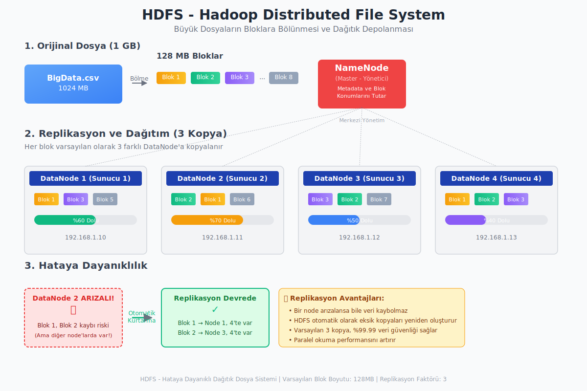

***

Merhaba gençler,

Bugün sizlerle son yılların en popüler konularından biri olan **Büyük Veri (Big Data)** üzerine konuşacağız. Bu kavramı muhtemelen duymuşsunuzdur ama tam olarak ne anlama geldiğini, neden bu kadar önemli olduğunu ve arkasındaki teknolojileri adım adım inceleyeceğiz.

### Büyük Veri Nedir?

En basit haliyle başlayalım. Elinizde tek bir kitaptan oluşan bir bilgi olduğunu düşünün. İçindeki bilgileri bulmak, analiz etmek oldukça kolaydır. Şimdi, o tek kitap yerine dünyanın en büyük kütüphanesindeki tüm kitapların, dergilerin, ses kayıtlarının ve videoların bir anda önünüze yığıldığını hayal edin. Üstelik bu kütüphaneye her saniye binlerce yeni materyal ekleniyor. İşte bu devasa, karmaşık ve sürekli büyüyen bilgi yığınına **Büyük Veri** diyoruz.

Geleneksel yöntemlerimiz, yani standart bir bilgisayar ve basit programlar, bu kütüphaneyi anlamlandırmak için yetersiz kalır. Bir soru sorduğunuzda cevabı saatler, hatta günler sürebilir. Büyük Veri alanı, tam da bu sorunu çözmek için var. Yani, birbirinden farklı kaynaklardan gelen (sosyal medya, sensörler, web siteleri, banka işlemleri vb.) devasa veri koleksiyonlarını;

*   Analiz etmeye,
*   İşlemeye,
*   ve Depolamaya adanmış bir alandır.

Büyük Veri'nin temel amacı, bu veri yığınının içindeki **değeri**, yani **anlamı** ortaya çıkarmaktır. Tıpkı bir madencinin tonlarca toprağı eleyerek değerli madenleri bulması gibi, biz de Büyük Veri'yi işleyerek değerli bilgilere ve öngörülere ulaşırız.

### Büyük Veri'nin Getirdiği Kazanımlar

Peki, bu devasa veriyi işlediğimizde elimize ne geçiyor? Elde ettiğimiz sonuçlar, kurumlar için çok çeşitli öngörülere ve kazanımlara yol açabilir. Örneğin:

*   **Operasyonel Optimizasyon:** Bir fabrikanın üretim hattındaki sensör verilerini analiz ederek arızaları önceden tespit edebilir ve üretimi daha verimli hale getirebiliriz.
*   **Eyleme Geçirilebilir Bilgi:** Müşteri davranışlarını analiz ederek onlara en uygun ürünleri, doğru zamanda sunabiliriz.
*   **Yeni Pazarların Tanımlanması:** Toplumdaki yeni eğilimleri ve ihtiyaçları herkesten önce fark ederek yeni iş fırsatları yaratabiliriz.
*   **Doğru Tahminler:** Hava durumu tahminlerinden borsa hareketlerine kadar, geçmiş verileri analiz ederek geleceğe dair daha isabetli öngörülerde bulunabiliriz.
*   **Hata ve Sahtekarlık Tespiti:** Bankacılıkta, anormal işlem desenlerini anında tespit ederek sahtekarlığı önleyebiliriz.
*   **Geliştirilmiş Karar Verme:** Sezgilere veya sınırlı bilgilere dayanmak yerine, somut verilere dayalı daha sağlam ve doğru kararlar alabiliriz.
*   **Bilimsel Keşifler:** Genom verilerinin analizinden uzay araştırmalarına kadar, bilim dünyasında çığır açan keşiflere imkan tanır.

### Veri Analitiği: Veriyi Anlamlandırma Sanatı

Büyük Veri'yi topladık, peki onu nasıl anlamlı hale getireceğiz? İşte burada **Veri Analitiği (Data Analytics)** devreye giriyor. Veri analitiği, ham veriden anlamlı sonuçlar çıkarmak için kullandığımız yöntemlerin, tekniklerin ve araçların tümünü kapsayan geniş bir disiplindir.

Bu analiz sürecini dört ana kategoriye ayırabiliriz. Bunu bir doktorun hasta teşhisi gibi düşünebilirsiniz:

1.  **Açıklayıcı Analitik (Descriptive Analytics): "Ne Oldu?"**
    Bu en temel analiz türüdür. Geçmişte ne olduğunu özetler.
    *   *Doktorun teşhisi:* "Hastanın ateşi 39 derece."
    *   *İş dünyasından örnekler:* "Geçen ay ne kadar satış yaptık?", "Hangi bölgeden daha çok destek talebi geldi?"

2.  **Tanısal Analitik (Diagnostic Analytics): "Neden Oldu?"**
    Olayların arkasındaki nedenleri bulmaya odaklanır.
    *   *Doktorun teşhisi:* "Kan tahlili sonuçlarına göre bu yüksek ateşin sebebi bakteriyel bir enfeksiyon."
    *   *İş dünyasından örnekler:* "Neden ikinci çeyrek satışları ilk çeyrekten daha düşüktü?", "Doğu bölgesindeki destek çağrıları neden Batı'dan fazlaydı?"

3.  **Tahmine Dayalı Analitik (Predictive Analytics): "Ne Olacak?"**
    Geçmiş verilerdeki desenleri kullanarak gelecekte ne olabileceğini tahmin eder.
    *   *Doktorun teşhisi:* "Bu enfeksiyon türü genellikle 3 gün içinde ilaç tedavisiyle kontrol altına alınır."
    *   *İş dünyasından örnekler:* "Bir müşterinin kredi borcunu ödememe olasılığı nedir?", "Bu reklam kampanyası yürütülürse satışlar ne kadar artar?"

4.  **Yönetsel (Normatif) Analitik (Prescriptive Analytics): "Ne Yapmalıyız?"**
    En gelişmiş analiz türüdür. Sadece ne olacağını söylemekle kalmaz, en iyi sonuca ulaşmak için ne yapılması gerektiğini de önerir.
    *   *Doktorun teşhisi:* "En iyi sonuç için bu antibiyotiği günde iki kez almalısınız."
    *   *İş dünyasından örnekler:* "Talebi karşılamak için hangi depodan hangi mağazaya ne kadar ürün göndermeliyiz?", "Kârı maksimize etmek için hangi ürünlere indirim yapmalıyız?"

### Büyük Veri'nin 5 Temel Özelliği (5V)

Bir veri setinin "Büyük Veri" olarak adlandırılabilmesi için genellikle "V" harfiyle başlayan beş temel özelliğe sahip olması beklenir.

1.
2.  **Hız (Velocity):** Verinin ne kadar hızlı üretildiğini ve işlenmesi gerektiğini belirtir. Bir yangın musluğundan akan su gibi düşünebilirsiniz. Örneğin, borsadaki anlık işlemler, bir jet motorundan gelen sensör verileri veya saniyede atılan binlerce tweet.
3.  **Çeşitlilik (Variety):** Verinin farklı türlerde ve formatlarda olmasını ifade eder. Sadece sayılardan oluşan düzenli tablolar (yapılandırılmış veri) değil, aynı zamanda metinler, e-postalar, videolar, ses kayıtları, fotoğraflar (yapılandırılmamış veri) ve XML/JSON dosyaları (yarı yapılandırılmış veri) gibi çok çeşitli formatları içerir.
4.  **Doğruluk (Veracity):** Verinin kalitesini ve güvenilirliğini temsil eder. İnternetteki her bilgi doğru değildir, değil mi? Veri setleri de "gürültü" içerebilir; yani eksik, hatalı veya tutarsız bilgiler barındırabilir. Analizden önce bu veriyi temizlemek ve doğruluğundan emin olmak çok önemlidir.
5.  **Değer (Value):** En önemli özellik budur. Eğer işlediğimiz veri, bize bir fayda sağlamıyor, bir sorunu çözmüyor veya bir karar almamıza yardımcı olmuyorsa, o veriyi toplamanın ve işlemenin bir anlamı yoktur. Verinin değeri, ne kadar doğru olduğu ve ne kadar hızlı işlenip anlamlı bir sonuca dönüştürüldüğü ile doğrudan ilişkilidir.

### Büyük Veri Depolama ve İşleme: Hadoop'a Giriş

Peki, bu devasa ve karmaşık veriyi nerede ve nasıl işleyeceğiz? Tek bir süper bilgisayar bile bu yükün altından kalkamaz. Çözüm, gücü bölmek ve dağıtmaktır. İşte burada **kümeler (clusters)** ve **dağıtılmış sistemler** devreye giriyor.

*   **Küme (Cluster):** Birbirine hızlı bir ağ ile bağlı çok sayıda standart bilgisayarın (bunlara *düğüm* veya *node* denir) tek bir sistem gibi çalışmasıdır. Görev, küçük parçalara bölünür ve her bir bilgisayar görevin bir parçasını üstlenir.
*   **Dağıtılmış Dosya Sistemi:** Büyük bir dosyayı tek bir bilgisayarda saklamak yerine, onu küçük parçalara (*bloklara*) bölerek kümedeki farklı bilgisayarlara dağıtan bir sistemdir. Böylece hem depolama kapasitesi artar hem de veriye aynı anda birden çok bilgisayar erişebilir.

Peki Hadoop tam olarak nedir? Şöyle düşünelim: Çok büyük bir yapbozu tek başınıza tamamlamanız haftalar sürebilir. Ama aynı yapbozu 100 arkadaşınıza dağıtırsanız, her biri kendi küçük parçasını yapar ve sonra bu parçaları birleştirerek yapbozu çok daha hızlı tamamlarsınız. Hadoop, tam olarak bu mantıkla çalışır; devasa bir veri işleme görevini, standart donanımlara sahip yüzlerce, hatta binlerce bilgisayardan oluşan bir kümeye dağıtır ve paralel olarak çözmelerini sağlar.

Daha yapısal bir bakışla, Hadoop'u dört ana bileşenden oluşan bir çerçeve olarak tanımlayabiliriz, bunlar:

1.  **HDFS (Hadoop Distributed File System):** Hadoop'un dağıtılmış depolama birimidir. Büyük dosyaları *blok* adı verilen parçalara ayırır ve kümedeki farklı makinelere dağıtır. Veri kaybını önlemek için her bloğun kopyalarını oluşturur ve farklı makinelere yedekler. Bu işleme *replikasyon* denir ve sistemin hataya karşı dayanıklı olmasını sağlar.

2.  **YARN (Yet Another Resource Negotiator):** Kümenin kaynak yöneticisidir. Hangi işin hangi makinede çalışacağını planlar, işlem gücü (CPU) ve bellek (RAM) gibi kaynakları işler arasında adil bir şekilde dağıtır. Kısacası kümenin işletim sistemi gibi davranır.
   
3.  **MapReduce:** Büyük veri işleme için kullanılan bir programlama modelidir. Temelde iki adımdan oluşur:
    *   **Map:** Büyük bir görevi alır ve onu kümedeki tüm makinelere dağıtılacak küçük, paralel görevlere böler. (Örneğin, milyonlarca belgedeki kelimeleri sayma görevini, her makinenin kendi üzerindeki birkaç belgeyi sayması şeklinde bölmek).
    *   **Reduce:** Map aşamasından gelen tüm kısmi sonuçları toplar ve tek bir nihai sonuçta birleştirir. (Örneğin, tüm makinelerden gelen kelime sayılarını toplayarak genel toplamı bulmak).
4.  **Hadoop Common:** Diğer Hadoop modüllerinin çalışması için gerekli olan ortak kütüphaneleri ve yardımcı programları içerir.

Bu yapı sayesinde Hadoop, hem çok büyük verileri uygun maliyetli bir şekilde depolayabilir hem de bu veriyi paralel olarak çok hızlı bir şekilde işleyebilir. Unutmayın ki gençler, Hadoop ve benzeri teknolojiler, Büyük Veri'nin potansiyelini gerçeğe dönüştüren temel araçlardır.